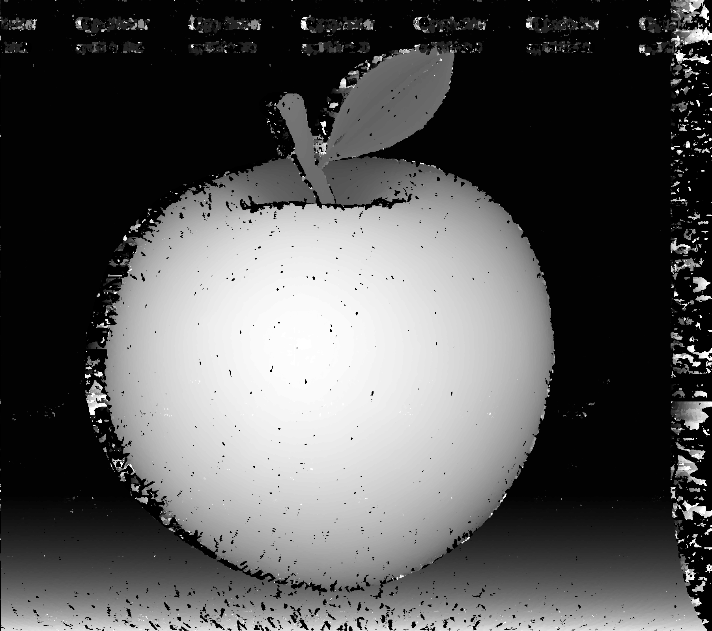
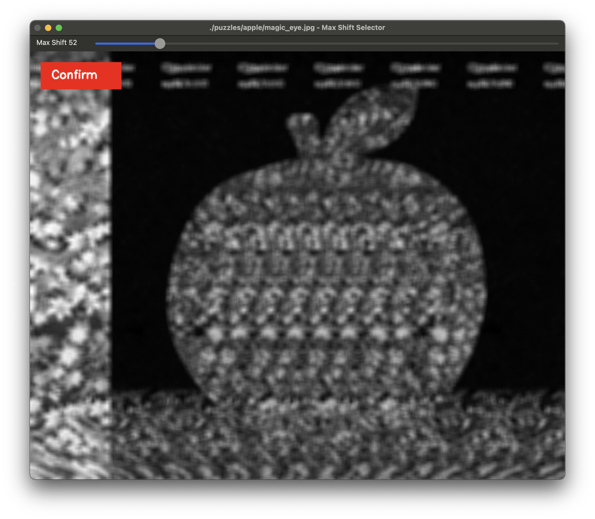

# Magic Eye Depth Map Extractor

## Overview
This Python program processes "Magic Eye" stereograms to generate depth maps. It iterates through a directory of Magic Eye images, computes depth differences, and produces a depth map for each image.

## Features
- Processes all subdirectories in the `puzzles/` directory.
- Detects and computes shift differences in stereograms.
- Uses an interactive UI to specify the minimum and maximum shift. The user selects the starting shift position where the 3D model begins and then selects the ending shift position for the background.
- Generates and saves depth maps as `depth_map.png`.
- Input images do not need to be grayscale; the program will handle color images as well.



## Installation

1. Clone the repository:
   ```sh
   git clone <repository-url>
   cd <repository-folder>
   ```

2. Install dependencies:
   ```sh
   pip install -r requirements.txt
   ```

## Usage

### Process a single Magic Eye image
```sh
python magic_eye_reverser.py puzzles/apple
```
This will process the `magic_eye.jpg` inside `puzzles/apple/` and generate `depth_map.png`.

### Process all Magic Eye images in the `puzzles` directory
```sh
python magic_eye_reverser.py
```
This will process all subdirectories inside `puzzles/`, generating depth maps.

## Directory Structure
```
project-root/
│── puzzles/
│   ├── apple/
│   │   ├── magic_eye.jpg
│   ├── cat_dunk/
│   │   ├── magic_eye.jpg
│   ├── ...
│── magic_eye_reverser.py
│── requirements.txt
│── README.md
```

## Dependencies
The program requires the following Python libraries:
- `opencv-python`
- `numpy`
- `matplotlib`
- `scikit-image`

Ensure all dependencies are installed using:
```sh
pip install -r requirements.txt
```

## How It Works

1. The program scans the `puzzles/` directory for subdirectories.
2. Each subdirectory is processed by:
   - Loading `magic_eye.jpg`.
   - Computing self-shifted image diffs.
   - Allowing the user to select which shift amount marks the closest point in the 3D model/scene and the furthest point (often a background). The model contours appear as black areas in the diff image.
     
   - Selecting which shift offset from the chosen range minimizes the difference for each pixel in the image. The minimal difference shift corresponds to the shift where that pixel appears darkest.
   - Normalizing the pixel depths, where white represents the closest points and black represents the furthest points.
   - Saving the depth map as `depth_map.png`.
3. The depth map is displayed during generation, and the window closes once processing is complete.

## Notes

- Ensure that each puzzle subdirectory contains a `magic_eye.jpg` file.
- Use high-quality stereograms for best results.

## License

This is free and open software. Do whatever (safe and legal things) you want to do with it.
